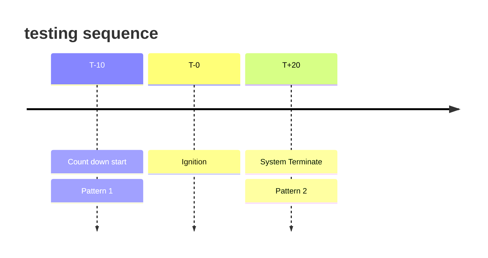

1. TOC
{:toc}

# What is the idea of this product ?
A test stand is required for homemade/amateur rocket motors when evaluating the motor performance, and there is no doubt that the goal is to measure the THRUST as accurately as possible. From my experience, the most common DAQ(Data Acquisition Systems) among amateur rocketeers is the combination of `Arduino` + `HX711 module`. I did used it in my early motor development. However, many annoying defects appeared soon after the first use. The most handful one is the lack of integration with the electrical components which that every `pinouts` were connected with the jumper wires. It was a disaster to set up the system whenever I need to conduct a thrust test and build up the frustration   every single time when the values on the terminal shown 0. Even worse, I still didn’t know which parts gone wrong after checking loose contacts between jumper cables. That’s when I made up my mind to develop a `PCB` that has all the components integrated in it.

# Product Introduction
The whole product generally consists of two parts,  respectively, `Structure/Hardware` and `PCB`. 

The **Structure** fixes the motor perpendicular to the ground, and the **PCB** logs data to SD CARD.
## [Click me to view online 3D model](https://a360.co/45VgSOc)
## Videos + Pictures
<iframe width="560" height="315" src="https://www.youtube.com/embed/qLWEzkJWCpg?si=jHXMhi5AeCBgDNQz" title="YouTube video player" frameborder="0" allow="accelerometer; autoplay; clipboard-write; encrypted-media; gyroscope; picture-in-picture; web-share" referrerpolicy="strict-origin-when-cross-origin" allowfullscreen></iframe>

<iframe width="560" height="315" src="https://www.youtube.com/embed/3m9vOonQnzA?si=8zCT0ne_OvWloZfz" title="YouTube video player" frameborder="0" allow="accelerometer; autoplay; clipboard-write; encrypted-media; gyroscope; picture-in-picture; web-share" referrerpolicy="strict-origin-when-cross-origin" allowfullscreen></iframe>

 
 


## Main Features
- Adjustable fixing structure to hold the motor
- Customizable DAQ
- Two power supply options
- SD card for data storage
- HX711 AD-DC converter + 10KG load cell
- LED and Buzzer to indicates different status
- Data monitoring from PC terminal
- Two external oscillators for different usages


# Product Data sheet
## MCU 
- STM32F103C8T6
## ADC(Analog-to-Digital Converter)
- HX711
## USB to TTL
- CH340T
## Power input
- Any USB-mini B input(<mark>Current must ≤ 1A</mark>)
- 9V battery 
## Ignition Power input
- 3V battery(1.5v * 2)
## switch
- Start button
- Safety button
- ~~Tare button~~

# Load cell connection with HX711
Pairs the `wires` and `Pinouts` with the following table

| Load cell | HX711 |
|:--------- |:----- | 
|**<font color="#007500">Green</font>**|  A+   |
|**<font color="#D0D0D0">White</font>**|  A-   |
|**<font color="#000000">Black</font>**|  E-   |
|**<font color="#AE0000">Red</font>**|  E+   |

# SD Card Configuration 

:::info
1.  Set the SD CARD `Format` to **FAT32**, `Allocation Unit Size` **4096**
 

:bulb:If the allocation unit size does not have the option `4096`, you may(need to) follow steps below to change it
- Win+R, enter `diskmgmt.msc`
- Select and right click the micro sd card, click the **Format**  
- Select the `file system` **FAT32**, `allocation unit size` **4096**
- Apply
:::

# BOM

Items that is included in the product

|         Item name          |    Specification | Quantities |
|:--------------------------:|:----------------:|:----------:|
|     Aluminum extrusion 2020|      160mm       |     4      |
|    Lumber core plywood     | 200 * 300 * 18mm |     1      |
|      3D printed item       |   fixing parts   |     2      |
|     Socket head screw      |     M5 * 40      |     8      |
|    Rounded Head Screws     |      M4 * 6      |     2      |
|    Rounded Head Screws     |      M3 * 8      |     4      |
|    Rounded Head Screws     |     M4 * 20      |     2      |
|    Rounded Head Screws     |     M4 * 30      |     4      |
|   Socket Head Cap Screw    |      M4 * 8      |     16     |
|         T-slot Nut         |        M4        |     16     |
| Hex Standoff, Male-Female  |     M4 * 10      |     4      |
| Hex Standoff, Male-Female  |     M3 * 10      |     4      |
| 9V battery to JST Power Cable |      PH 2.0   |     1      |
| 3V battery to JST Power Cable |      PH 2.0   |     1      |
| 10 KG load cell with 4P jumper|    P=2.54mm   |    1       |

# Product User Manual

## Testing Sequence
The LED indicator <mark>blinks</mark> when the DAQ can't read/write the SD card. 

{: .note }
Please checkout the **SD-Card-Configuration** above if that occurs.

> [!IMPORTANT]
> This is an important callout.

```markdown
{: .note }
A paragraph
```


|time stamps|         physical instruction         |    buzzer indicator | LED indicator |
|:---:|:------------------------:|:--------------:|:---------:| 
|     |         Hardware Assemble         |               |        |
|     |        SD card plug in        |               |       |
|     |         Battery Insert         |               |         |
|     | System Testing   |                |<mark>blinks</mark>|
|     |        motor insert       |               |           | 
|     |        E-match insert       |               |           |
|T-10 |       Count down start       |      Pattern 1    |             |
|T-0  |           Ignition          |          |           |
|T+20 |       System Terminates      |     Pattern 2     |           | 
|     |         Battery Remove         |                 |           |
|     |           Clean Up          |                |           |




## Pattern 1
Buzzer repeats the exact pattern1 `10 times(10s)` after the start button is pressed, indicating the testing sequence starts.
## Pattern 2
Buzzer beeps for `2s` after the sequence is finished and terminated.
# Extended Product Usage/ Development
Considered to a various of users and for different usages, people are designed to  easily modify the code with their need. There are also extra pins on the side of the PCB.

[STM32F103C8T6 Datasheet](https://www.st.com/resource/en/datasheet/stm32f103c8.pdf)

[Github source code](https://github.com/Herokroos/test_stand)